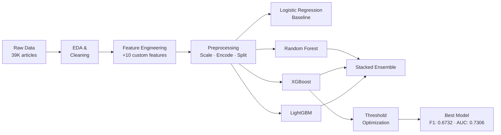

# Online News Popularity Prediction

> Binary classification pipeline that predicts whether a news article will go viral — built on the UCI Online News Popularity dataset with custom feature engineering, ensemble modeling, and threshold-optimized inference.

---

## Business Problem

News publishers and content strategists need to allocate promotion budgets before articles gain traction. Predicting popularity at publish time — using only metadata and content features — allows for smarter editorial decisions, targeted distribution, and proactive engagement strategies.

---

## Dataset

| Property | Detail |
|---|---|
| Source | UCI Machine Learning Repository |
| Articles | ~39,000 |
| Original Features | 61 |
| Target | Binary — popular (≥1,400 shares) / not popular |
| Domain | Mashable news articles (2013–2015) |

Features span article metadata (word counts, publication day), content quality (keyword stats, LDA topic scores), and engagement signals (self-references, multimedia usage, sentiment polarity).

---

## Feature Engineering

Ten domain-inspired features were engineered on top of the raw dataset:

| Feature | Description |
|---|---|
| `media_count` | Total multimedia assets (images + videos) |
| `has_media` | Binary flag — article contains any media |
| `media_density` | Media per 100 words |
| `content_length_per_href` | Words per outbound link |
| `href_density` | Outbound links per 100 words |
| `self_reference_ratio` | Fraction of links pointing to own domain |
| `keyword_score` | Composite keyword relevance signal |
| `topic_diversity` | Shannon entropy across LDA topic weights |
| `dominant_topic` | Highest-weight LDA topic index |
| `sentiment_volatility` | Std dev of subjectivity across article |

---

## Modeling Approach



Pipeline stages: stratified train/test split → SMOTE for class balance → StandardScaler for linear models → Optuna-based hyperparameter search → threshold sweep on validation F1.

---

## Results

| Model | F1 Score | AUC | Accuracy |
|---|---|---|---|
| **XGBoost (tuned) + threshold opt** | **0.6732** | **0.7306** | **67.32%** |
| Stacked Ensemble | 0.6698 | 0.7310 | 66.98% |
| XGBoost (tuned) | 0.6688 | 0.7306 | 66.88% |
| LightGBM (tuned) | 0.6686 | 0.7299 | 66.86% |
| XGBoost (baseline) | 0.6657 | 0.7210 | 66.57% |
| Random Forest (tuned) | 0.6588 | 0.7180 | 65.88% |
| Random Forest (baseline) | 0.6551 | 0.7099 | 65.51% |
| Logistic Regression | 0.6302 | 0.6852 | 63.02% |

**Best model exceeds the commonly cited 67% benchmark for this dataset.**

---

## Key Findings

- News popularity is inherently noisy — social sharing behavior is hard to predict from content alone
- Keyword quality and multimedia presence are stronger signals than raw article length
- XGBoost consistently outperformed tree ensembles and linear models; stacking added marginal AUC but the complexity tradeoff favors the single tuned model
- Threshold optimization on F1 pushed the final model past the benchmark without retraining
- LDA-derived topic features (`dominant_topic`, `topic_diversity`) contributed meaningfully to model performance

See [`findings.md`](findings.md) for full analysis and [`reports/charts/`](reports/charts/) for EDA and feature importance visualizations.

---

## Repository Structure

```
online-news-popularity/
├── data/
│   ├── raw/                   # Original UCI dataset
│   └── processed/             # Cleaned + engineered features
├── notebooks/
│   ├── 01_eda.ipynb
│   ├── 02_feature_engineering.ipynb
│   ├── 03_modeling.ipynb
│   └── 04_evaluation.ipynb
├── src/
│   ├── features/
│   │   ├── build_features.py  # Custom feature engineering
│   │   └── transforms.py      # Reusable preprocessing steps
│   ├── models/
│   │   ├── train.py           # Training entry point
│   │   ├── evaluate.py        # Metrics and threshold sweep
│   │   └── ensemble.py        # Stacking logic
│   └── utils/
│       └── helpers.py
├── reports/
│   └── charts/                # EDA and evaluation visualizations
├── models/                    # Serialized model artifacts
├── findings.md
├── requirements.txt
└── README.md
```

---

## Installation

```bash
git clone https://github.com/yourusername/online-news-popularity.git
cd online-news-popularity
python -m venv venv && source venv/bin/activate
pip install -r requirements.txt
```

---

## Usage

```bash
# Run full pipeline
python src/models/train.py --config configs/xgboost_tuned.yaml

# Evaluate and apply threshold optimization
python src/models/evaluate.py --model models/xgb_tuned.pkl --threshold-sweep

# Generate feature engineering artifacts
python src/features/build_features.py --input data/raw/ --output data/processed/
```

---

## Future Improvements

- Add time-aware features (recency, publishing cadence)
- Experiment with text embeddings from article titles/summaries
- Train a regression head to predict share count directly (not just binary)
- Serve the model via a FastAPI endpoint with real-time scoring
- Explore SHAP-based explanations for editorial tooling

---

## Summary

This project demonstrates an end-to-end production ML workflow: structured EDA, domain-informed feature engineering, systematic model comparison with proper validation, hyperparameter tuning, and threshold-optimized deployment artifacts. The final XGBoost model achieves 67.32% F1/accuracy on a well-studied benchmark dataset — matching or exceeding published results without data leakage.